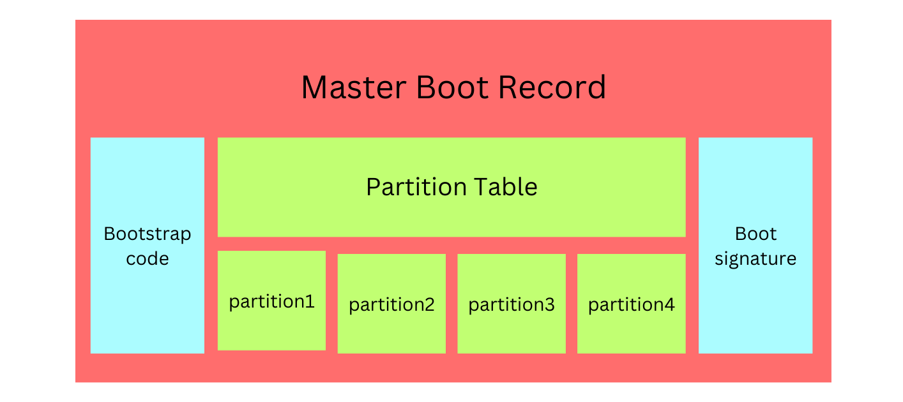

# 💻Process Sec 3

รายงานฉบับนี้จัดทำขึ้นเพื่อเป็นส่วนหนึ่งของวิชา Computer Organization and Operating System รหัสวิชา 06016412 \
ชั้นปีที่ 2 สถาบันเทคโนโลยีพระจอมเกล้าเจ้าคุณทหารลาดกระบัง \
\
เสนอ _**ผศ.ดร. สุเมธ ประภาวัต**_


<font size=1 ><p align="center">📑[Contents](#table-of-contents)</p></font>

## 🧾บทคัดย่อ

&nbsp;&nbsp;&nbsp;&nbsp;&nbsp;&nbsp;&nbsp;&nbsp;&nbsp;&nbsp; รายงานชิ้นนี้มีวัตถุประสงค์เพื่อให้ผู้อ่านได้ศึกษาเกี่ยวกับกระบวนการทำงานของคอมพิวเตอร์ในขั้นตอนต่าง ๆ ตั้งแต่เริ่มต้นเปิดเครื่องคอมพิวเตอร์จนถึงเสร็จสิ้นการทำงานของอุปกรณ์ และเพื่อให้ผู้อ่านสามารถดูแลจัดการระบบคอมพิวเตอร์ได้อย่างมีเสถียรภาพอยู่เสมอ โดยมีเนื้อหาสำคัญดังนี้

    Boots Process
        จะเกิดการทำงานขึ้นเมื่อมีการกดปุ่มเปิดเครื่อง และทำงานไปจนถึงการแสดงหน้า Log In เข้าสู่ระบบ
        โดยจะตรวจสอบการทำงานของ Hardware ผ่าน BIOS จากนั้น GRUB จะช่วยในการเข้าถึง Kernel ภายใน Files System

    Process Manager
        ทักษะการจัดการควบคุมและตรวจสอบสถานการณ์การทำงานของระบบมิให้เกิดข้อบกพร่องขึ้นในระบบ Operating System
        โดยที่เป็นทักษะสำคัญของผู้จัดการดูแลระบบคอมพิวเตอร์ นอกจากนี้ยังรวมไปถึงการจัดการทรัพยากรภายในระบบอีกด้วย

    Services Manager
        คือ Process การทำงานบน Server เพื่อจัดการ Request ต่าง ๆ
        ซึ่งอาจถูกส่งมาจาก Client หรือ Process อื่น ๆ ที่ทำงานอยู่ร่วมกันภายในระบบ Operating System เดียวกัน

    Task Scheduler
        เป็นตัวช่วยจัดการปัญหาของระบบ Operating System ที่ทำหน้าที่เป็นเสมือนนาฬิกาจับเวลาการทำงานต่าง ๆ
        ซึ่งสามารถสั่งทำงานตามคำสั่งต่าง ๆ ที่ผู้ใช้กำหนดให้ เมื่อถึงเวลาที่กำหนดเอาไว้ได

## 📖คำนำ

&nbsp;&nbsp;&nbsp;&nbsp;&nbsp;&nbsp;&nbsp;&nbsp;&nbsp;&nbsp; รายงานฉบับนี้จัดทำขึ้นเพื่อเป็นส่วนหนึ่งของวิชา Computer Organization and Operating System รหัสวิชา 06016412 ชั้นปีที่ 2 สถาบันเทคโนโลยีพระจอมเกล้าเจ้าคุณทหารลาดกระบัง โดยมีวัตถุประสงค์เพื่อทำความเข้าใจในระบบประมวลผลและการดำเนินการในระบบคอมพิวเตอร์ เนื่องในปัจจุบันระบบคอมพิวเตอร์เข้ามามีบทบาทสำคัญในชีวิตของมนุษย์เราเป็นอย่างมาก การศึกษาและทำความเข้าใจในเรื่องของคอมพิวเตอร์และการทำงานของระบบคอมพิวเตอร์นั้นจึงมีความจำเป็นอย่างยิ่งต่อสายอาชีพหรือสายงานที่มีความจำเป็นต้องทำงานร่วมกับคอมพิวเตอร์ หรือแม้แต่ผู้ที่มีความสนใจทางด้านคอมพิวเตอร์
\
\
&nbsp;&nbsp;&nbsp;&nbsp;&nbsp;&nbsp;&nbsp;&nbsp;&nbsp;&nbsp; คณะผู้จัดทำผู้จัดทำได้เลือกหัวข้อนี้ในการทำรายงาน เนื่องมาจากเป็นเรื่องที่น่าสนใจ และมีความจำเป็นอย่างยิ่งในการทำงานทางสายงานที่เกี่ยวข้องทั้งทางตรงและทางอ้อม รวมถึงเป็นการมอบความรู้ที่สำคัญให้แก่ผู้ที่ต้องการศึกษาในเรื่องเดียวกันนี้ ผู้จัดทำขอขอบคุณ อาจารย์ **ผศ. อัครินทร์ คุณกิตติ** อาจารย์ **ผศ.ดร. สุเมธ ประภาวัต** และอาจารย์ **ผศ.ดร. ประพันธ์ ปวรางกูร** ผู้ให้ความรู้ และแนวทางการศึกษาแก่คณะผู้จัดทำ ๆ ทุกคน ทางคณะผู้จัดทำหวังว่ารายงานฉบับนี้จะให้ความรู้ และเป็นประโยชน์แก่ผู้อ่านทุก ๆ ท่าน

## 📑Table of Contents

- [บทคัดย่อ](#บทคัดย่อ)🧾
- [คำนำ](#คำนำ)📖
- [Overview](#overview-of-computer-process)🧑‍💻
- [Boots Process](#boots-process)⚙️
	- [BIOS (Basic Input/Output System)](#bios)
	- [MBR (Master Boot Record)](#mbr)
	- [GRUB (Grand Unified Bootloader)](#grub)
	- [Kernel](#kernel)
	- [init](#init)
	- [Run Level](#run-level)
- [Process Manager](#process-manager)🧑‍💼
- [Services Manager](#services-manager)🤝
- [Task Scheduler](#task-scheduler)⏳
- [References](#references)🔗
- [Group Member](#member)👪

## 🧑‍💻Overview of Computer Process

## ⚙Boots Process

**Boot process** คือ กระบวนการทำงานของเครื่องคอมพิวเตอร์ตั้งแต่การกดปุ่มเปิดเครื่องไปจนถึงการแสดงหน้า Login โดยทั่วไปจะมีอยู่ 6 Stage ด้วยกัน ดังนี้

### _BIOS_

**BIOS** (หรือ **Basic Input/Output System**) จะเริ่มการทำงานหลังจากกดปุ่มเปิดเครื่อง จะทำงานเป็นหลักในระดับ Hardware จากนั้นจะเกิดขั้นตอนที่เรียกว่า _**POST (Power-On Self-Test)**_ เพื่อตรวจสอบการทำงานของ Hardware ที่สำคัญต่าง ๆ ว่าทำงานได้อย่างถูกต้องหรือไม่ หากไม่มีสิ่งปกติผิดปกติเกิดขึ้นกับ Hardware เหล่านั้น BIOS ก็จะดำเนินการเลือก Boot Device ซึ่งโดยปกติจะตรวจสอบที่ Hard Drives เป็นลำดับแรก ก่อนจะดำเนินการตรวจสอบที่ USB จากนั้นจึงตรวจสอบภายในที่ CD พร้อมเรียกหา Boot Loader และนำมาใส่ไว้ใน Memory เพื่อให้ Boot Loader รับหน้าที่ต่อแทนในขั้นตอนถัดไป

<p align="center">
  
</p>

<font size=1 ><p align="center">ภาพจาก : [https://operavps.com/docs/linux-booting-process/](https://operavps.com/docs/linux-booting-process/)</p></font>

### _MBR_

**MBR** (หรือ **Master Boot Record**) เป็นพื้นที่จัดเก็บ Boot Loader Code (อยู่บริเวณ Sector แรกของ Drive) และเป็นที่อยู่ของข้อมูลที่เกี่ยวกับ **GRUB** (หรือ **LILO** ในระบบที่ค่อนข้างเก่า)  

<font size=1 ><p align="center">
	<br />
	ภาพจาก : [https://www.youtube.com/watch?v=XpFsMB6FoOs](https://www.youtube.com/watch?v=XpFsMB6FoOs&t=214s)</p></font>

โดยหน้าที่หลักของ MBR คือการโหลด GRUB มา Executes 
MBR มีขนาด 512 bytes ประกอบไปด้วย 3 ส่วน
> 1.	**Primary boot loader information _446 byte_**
> 2.	**Partition table information _64 byte_ (16x4)**
> 3.	**MBR validation check _2 byte_**

<p align="center">
  
</p>

<font size=1 ><p align="center">ภาพจาก : [https://foxyknight29.medium.com/linux-booting-process-bb8f9036c43d](https://foxyknight29.medium.com/linux-booting-process-bb8f9036c43d)</p></font>

### _GRUB_

**GRUB** (หรือ **Grand Unified Bootloader**) มีหน้าที่ในการ Execute Kernel Image (หรือ OS Image) โดยจะแสดงหน้าจอขึ้นมาให้ผู้ใช้งานสามารถเลือกได้ว่า ต้องการที่จะใช้ Kernel Image ตัวไหน และใช้ initrd ใด

GRUB และ LILO เป็น Boot Loader เช่นเดียวกัน แต่ต่างกันตรงที่ GRUB รู้จัก File System ซึ่งทำให้สามารถเข้าถึงและเรียกใช้ Kernel จากภาย File System ได้

ปัจจุปันใช้ GRUB ที่มีชื่อว่า GRUB2

<p align="center">
  
</p>

<font size=1 ><p align="center">ภาพจาก : [https://linuxmint-user-guide.readthedocs.io/en/latest/grub.html](https://linuxmint-user-guide.readthedocs.io/en/latest/grub.html)</p></font>

### _Kernel_

OS จะสามารถมีความสามารถในการเข้าถึงทรัพยากรต่าง ๆ ภายในเครื่องได้ด้วยตัวเองภายใน Stage นี้
 
เมื่อ Kernel ถูก Boot Loader init ขึ้นมา Kernel จะทำการ mount ตัว _initrd_ (Initial RAM Disk) ให้เป็น root ของ File System (ซึ่งก็คือ ‘/’ ) แบบชั่วคราว จากนั้นจึงจะ Execute โปรแกรมภายใน /sbin/init ทำให้เกิด Process แรกที่ชื่อ init (หากพิมพ์คำสั่ง ps -ef | grep init ก็จะเห็นว่ามีค่า PID เป็น 1) 
  
เมื่อ Kernel ทำการบูทจนเสร็จสิ้น จึงจะเกิดการ mount root ของ File System ตัวจริง ที่มี Drivers ที่สำคัญต่าง ๆ เข้ามาช่วยในการเข้าถึงทรัพยากรบนเครื่องคอมพิวเตอร์

### _init_

เมื่อดำเนินการมาจนถึง Stage นี้แล้ว ตัว init system จะทำการอ่านการตั้งค่าภายใน /etc/inittab เพื่อตรวจสอบว่าจะต้องใช้ Run Level ใดในการกำหนด System States ซึ่งขึ้นอยู่กับการตั้งค่า default

โดยในแต่ละ Run Level จะมี Services และ Processes ที่แตกต่างกันไปขึ้นอยู่กับว่าต้องการให้ระบบทำอะไร สามารถแบ่งได้เป็น Level 0 จนถึง Level 6 ดังนี้

0. Halt
1. Single user mode
2. Multiuser, without NFS
3. Full multiuser mode
4. Unused
5. X11
6. Reboot

<p align="center">
  
</p>

<font size=1 ><p align="center">ภาพจาก : [https://foxyknight29.medium.com/linux-booting-process-bb8f9036c43d](https://foxyknight29.medium.com/linux-booting-process-bb8f9036c43d)</p></font>

นอกจากนี้ ยังสามารถเปลี่ยน Run Level ได้ในขณะที่ระบบทำงานอยู่ได้ด้วยคำสั่งจากผู้ใช้
เช่น หากอยากเปลี่ยนเป็น Run Level เป็น Level 3

```sh
sudo systemctl isolate multi-user.target 
```	

หรือเปลี่ยนเป็น Level 5
```sh
sudo systemctl isolate graphical.target
```	

### Run Level

ใน Stage นี้จะเกิดการ Execute โปรแกรมที่ต้องถูกใช้งานในแต่ละ Run Level ซึ่งจะถูกเลือกจาก Directory ของแต่ละ Run Level

จึงเป็นเหตุให้ Service บางตัวเกิดการเริ่มต้นทำงานขึ้นมา รวมไปถึง Service ของการ Login ด้วย 
Stage นี้จึงเป็น stage สุดท้ายของ Boot Process ในการเตรียมการให้พร้อม สำหรับ User Interaction 

โดยใน /etc/rc.d/rc[run level].d/ Directories จะเห็นโปรแกรมขึ้นต้นด้วยตัวอักษร **S** หรือ **K**	เช่น	
```sh
/etc/rc.d/rc3.d/S50apache2	
/etc/rc.d/rc3.d/K20mysql
```	
โดยตัวอักษร **S** หมายถึง Process ที่จะถูก Executed ให้ **เริ่ม** เมื่อ Start Up เครื่องคอมพิวเตอร์<br>
และตัวอักษร **K** หมายถึง Process ที่จะถูก Executed ให้ **หยุด** เมื่อ Shut Down เครื่องคอมพิวเตอร์

## 🧑‍💼Process Manager

## 🤝Services Manager

## ⏳Task Scheduler

## 🔗References

[^]
[^]
[^]
[^]
[^]
[^]
[^]
[^]

## 👪Member

> <br>
> 65070099 นายธนาวัลย์ แช่มเสถียร<br>
> Duty: Process Manager

> <br>
> 65070<br>
> Duty: Task Scheduler

> <br>
> 65070130 นายปรเมศร์ เชื้อทอง<br>
> Duty: Boots Process

> <br>
> 65070162 นายพีรวิชญ์ พิชญธาดาพงศ์<br>
> Duty: Overview / บทคัดย่อ / คำนำ / Markdown Document / GitHub

> <br>
> 65070163 นายพีระวัฒน์ พันธ์ยนต์<br>
> Duty: Services Manager

> <br>
> 65070174 นายภาคิน จันทร์จำลอง<br>
> Duty: Process Manager

## Thanks for Reading!!!

<font size=1><p align="center">
Bye Bye!<br>

</p></font><br />
<h3 align="center">Luv U <3!!</h3>
