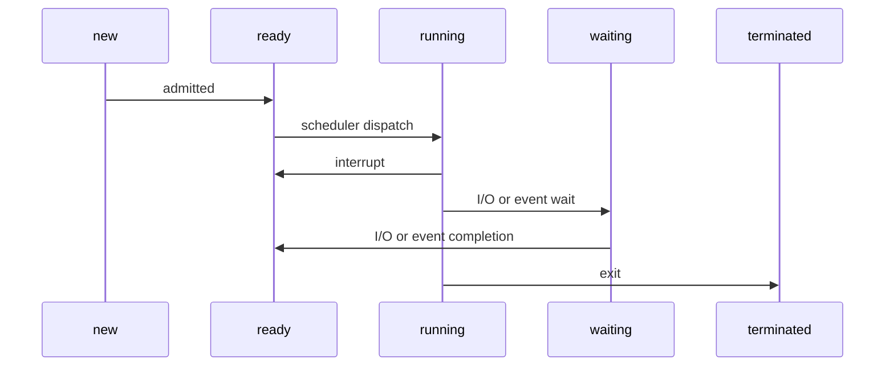

# 💻Process Sec 3

รายงานฉบับนี้จัดทำขึ้นเพื่อเป็นส่วนหนึ่งของวิชา Computer Organization and Operating System รหัสวิชา 06016412 \
ชั้นปีที่ 2 สถาบันเทคโนโลยีพระจอมเกล้าเจ้าคุณทหารลาดกระบัง \
\
เสนอ _**ผศ.ดร. สุเมธ ประภาวัต**_


<font size=1 ><p align="center">📑[Contents](#table-of-contents)</p></font>

## 🧾บทคัดย่อ

&nbsp;&nbsp;&nbsp;&nbsp;&nbsp;&nbsp;&nbsp;&nbsp;&nbsp;&nbsp; รายงานชิ้นนี้มีวัตถุประสงค์เพื่อให้ผู้อ่านได้ศึกษาเกี่ยวกับกระบวนการทำงานของคอมพิวเตอร์ในขั้นตอนต่าง ๆ ตั้งแต่เริ่มต้นเปิดเครื่องคอมพิวเตอร์จนถึงเสร็จสิ้นการทำงานของอุปกรณ์ และเพื่อให้ผู้อ่านสามารถดูแลจัดการระบบคอมพิวเตอร์ได้อย่างมีเสถียรภาพอยู่เสมอ โดยมีเนื้อหาสำคัญดังนี้

    Boots Process
        จะเกิดการทำงานขึ้นเมื่อมีการกดปุ่มเปิดเครื่อง และทำงานไปจนถึงการแสดงหน้า Log In เข้าสู่ระบบ
        โดยจะตรวจสอบการทำงานของ Hardware ผ่าน BIOS จากนั้น GRUB จะช่วยในการเข้าถึง Kernel ภายใน Files System

    Process Manager
        ทักษะการจัดการควบคุมและตรวจสอบสถานการณ์การทำงานของระบบมิให้เกิดข้อบกพร่องขึ้นในระบบ Operating System
        โดยที่เป็นทักษะสำคัญของผู้จัดการดูแลระบบคอมพิวเตอร์ นอกจากนี้ยังรวมไปถึงการจัดการทรัพยากรภายในระบบอีกด้วย

    Services Manager
        คือ Process การทำงานบน Server เพื่อจัดการ Request ต่าง ๆ
        ซึ่งอาจถูกส่งมาจาก Client หรือ Process อื่น ๆ ที่ทำงานอยู่ร่วมกันภายในระบบ Operating System เดียวกัน

    Task Scheduler
        เป็นตัวช่วยจัดการปัญหาของระบบ Operating System ที่ทำหน้าที่เป็นเสมือนนาฬิกาจับเวลาการทำงานต่าง ๆ
        ซึ่งสามารถสั่งทำงานตามคำสั่งต่าง ๆ ที่ผู้ใช้กำหนดให้ เมื่อถึงเวลาที่กำหนดเอาไว้ได

## 📖คำนำ

&nbsp;&nbsp;&nbsp;&nbsp;&nbsp;&nbsp;&nbsp;&nbsp;&nbsp;&nbsp; รายงานฉบับนี้จัดทำขึ้นเพื่อเป็นส่วนหนึ่งของวิชา Computer Organization and Operating System รหัสวิชา 06016412 ชั้นปีที่ 2 สถาบันเทคโนโลยีพระจอมเกล้าเจ้าคุณทหารลาดกระบัง โดยมีวัตถุประสงค์เพื่อทำความเข้าใจในระบบประมวลผลและการดำเนินการในระบบคอมพิวเตอร์ เนื่องในปัจจุบันระบบคอมพิวเตอร์เข้ามามีบทบาทสำคัญในชีวิตของมนุษย์เราเป็นอย่างมาก การศึกษาและทำความเข้าใจในเรื่องของคอมพิวเตอร์และการทำงานของระบบคอมพิวเตอร์นั้นจึงมีความจำเป็นอย่างยิ่งต่อสายอาชีพหรือสายงานที่มีความจำเป็นต้องทำงานร่วมกับคอมพิวเตอร์ หรือแม้แต่ผู้ที่มีความสนใจทางด้านคอมพิวเตอร์
\
\
&nbsp;&nbsp;&nbsp;&nbsp;&nbsp;&nbsp;&nbsp;&nbsp;&nbsp;&nbsp; คณะผู้จัดทำผู้จัดทำได้เลือกหัวข้อนี้ในการทำรายงาน เนื่องมาจากเป็นเรื่องที่น่าสนใจ และมีความจำเป็นอย่างยิ่งในการทำงานทางสายงานที่เกี่ยวข้องทั้งทางตรงและทางอ้อม รวมถึงเป็นการมอบความรู้ที่สำคัญให้แก่ผู้ที่ต้องการศึกษาในเรื่องเดียวกันนี้ ผู้จัดทำขอขอบคุณ อาจารย์ **ผศ. อัครินทร์ คุณกิตติ** อาจารย์ **ผศ.ดร. สุเมธ ประภาวัต** และอาจารย์ **ผศ.ดร. ประพันธ์ ปวรางกูร** ผู้ให้ความรู้ และแนวทางการศึกษาแก่คณะผู้จัดทำ ๆ ทุกคน ทางคณะผู้จัดทำหวังว่ารายงานฉบับนี้จะให้ความรู้ และเป็นประโยชน์แก่ผู้อ่านทุก ๆ ท่าน

## 📑Table of Contents

- [บทคัดย่อ](#บทคัดย่อ)🧾
- [คำนำ](#คำนำ)📖
- [Overview](#overview-of-computer-process)🧑‍💻
- [Boot Process](#boot-process)⚙️
	- [BIOS (Basic Input/Output System)](#bios)
	- [MBR (Master Boot Record)](#mbr)
	- [GRUB (Grand Unified Bootloader)](#grub)
	- [Kernel](#kernel)
	- [init](#init)
	- [Run Level](#run-level)
- [Process Manager](#process-manager)🧑‍💼
  	- [Types of Process](#types-of-process)
  	- [Process States](#process-states)
  	- [Commands](#commands-used-to-manage-processes-in-linux)
- [Services Manager](#services-manager)🤝
- [Task Scheduler](#task-scheduler)⏳
  	- [cron](#cron)
  	- [crontab](#crontab)
  	- [at](#at)
  	- [Time Format](#time-format)
- [References](#references)🔗
- [Group Member](#member)👪

## 🧑‍💻Overview of Computer Process

Process หมายถึง โปรแกรมที่กำลังจะถูกประมวลผล หรือกำลังจะถูกทำการ Execute โดยจะ Execute เข้าไปใน RAM

ซึ่งการ Process จะมีสิ่งที่เรียกว่า Process State (กระบวนการทำงานในแต่ละขั้นของการ Process ในระหว่างที่ Program กำลังจะถูก Execute)

### Process State

Process State มีขั้นตอนที่เป็นส่วนประกอบอยู่ด้วยทั้งหมด 5 ส่วน ได้แก่
1. new : บ่งบอกถึง ได้ทำการสร้าง หรือจองพื้นที่ใน memory แล้ว
2. ready : เป็นส่วนของการรอ processor ที่จะทำการดึงคำสั่งไปใช้ในการ execute
3. running : คำสั่งนั้น กำลังจะถูก execute
4. waiting : เป็นการรอคำสั่งอื่นให้เกิดขึ้นก่อน
5. terminate : process ได้ถูก execute เรียบร้อยแล้ว



1. เริ่มต้นต้องทำการสร้าง Process new ก่อน โดย Process มีสถานะเป็น new ก็ต่อเมื่อถูกสร้างขึ้นมา โดยการจองพื้นที่บน Memory
2. เมื่อกลายเป็น Process new แล้ว จะเปลี่ยนสถานะเป็น ready โดยจะทำการเปลี่ยนก็ต่อเมื่อ Process ถูกรับเข้ามาในคิว เพื่อรอทำงาน
3. ต่อมาเป็นการ running โดย Process ready จะเปลี่ยนเป็น running ก็ต่อเมื่อในคิวถูกส่งไปทำงานบน CPU
4. เมื่อ running อยู่ถึงคำสั่งสุดท้ายแล้ว Process จะถูกสั่ง terminate ซึ่งก็คือ จบ Process ทันที
	- ถ้า running แล้วถูกสั่งด้วยคำสั่ง input output อื่นๆ ก็จะถูกส่งไปที่สถานะ waiting
	- Process ใดๆ ที running อยู่ จะเปลี่ยนสถานะเป็น ready ก็ต่อเมื่อเกิดการ interrupt จาก short term schedulers หรือ I/O request
	- เมื่อขอใช้ I/O และ waiting อยู่ จะย้ายจาก waiting เป็น ready ก็ต่อเมื่อได้รับข้อมูล I/O request นั้นๆเีรียบร้อยแล้ว

โดยที่แต่ละ process จะมี PID (Process ID) ที่ไม่ซ้ำกัน และทำงานแยกกัน ไม่รบกวนกัน

## ⚙Boot Process

**Boot process** คือ กระบวนการทำงานของเครื่องคอมพิวเตอร์ตั้งแต่การกดปุ่มเปิดเครื่องไปจนถึงการแสดงหน้า Login โดยทั่วไปจะมีอยู่ 6 Stage ด้วยกัน ดังนี้

### _BIOS_

**BIOS** (หรือ **Basic Input/Output System**) จะเริ่มการทำงานหลังจากกดปุ่มเปิดเครื่อง จะทำงานเป็นหลักในระดับ Hardware จากนั้นจะเกิดขั้นตอนที่เรียกว่า _**POST (Power-On Self-Test)**_ เพื่อตรวจสอบการทำงานของ Hardware ที่สำคัญต่าง ๆ ว่าทำงานได้อย่างถูกต้องหรือไม่ หากไม่มีสิ่งปกติผิดปกติเกิดขึ้นกับ Hardware เหล่านั้น BIOS ก็จะดำเนินการเลือก Boot Device ซึ่งโดยปกติจะตรวจสอบที่ Hard Drives เป็นลำดับแรก ก่อนจะดำเนินการตรวจสอบที่ USB จากนั้นจึงตรวจสอบภายในที่ CD พร้อมเรียกหา Boot Loader และนำมาใส่ไว้ใน Memory เพื่อให้ Boot Loader รับหน้าที่ต่อแทนในขั้นตอนถัดไป

<p align="center">
  
</p>

<font size=1 ><p align="center">ภาพจาก : [https://operavps.com/docs/linux-booting-process/](https://operavps.com/docs/linux-booting-process/)</p></font>

---

### _MBR_

**MBR** (หรือ **Master Boot Record**) เป็นพื้นที่จัดเก็บ Boot Loader Code (อยู่บริเวณ Sector แรกของ Drive) และเป็นที่อยู่ของข้อมูลที่เกี่ยวกับ **GRUB** (หรือ **LILO** ในระบบที่ค่อนข้างเก่า)  

<font size=1 ><p align="center">
	
</font>

โดยหน้าที่หลักของ MBR คือการโหลด GRUB มา Executes 
MBR มีขนาด 512 bytes ประกอบไปด้วย 3 ส่วน
> 1.	**Primary boot loader information _446 byte_**
> 2.	**Partition table information _64 byte_ (16x4)**
> 3.	**MBR validation check _2 byte_**

<p align="center">
  
</p>

<font size=1 ><p align="center">ภาพจาก : [https://foxyknight29.medium.com/linux-booting-process-bb8f9036c43d](https://foxyknight29.medium.com/linux-booting-process-bb8f9036c43d)</p></font>

---

### _GRUB_

**GRUB** (หรือ **Grand Unified Bootloader**) มีหน้าที่ในการ Execute Kernel Image (หรือ OS Image) โดยจะแสดงหน้าจอขึ้นมาให้ผู้ใช้งานสามารถเลือกได้ว่า ต้องการที่จะใช้ Kernel Image ตัวไหน และใช้ initrd ใด

GRUB และ LILO เป็น Boot Loader เช่นเดียวกัน แต่ต่างกันตรงที่ GRUB รู้จัก File System ซึ่งทำให้สามารถเข้าถึงและเรียกใช้ Kernel จากภาย File System ได้

ปัจจุปันใช้ GRUB ที่มีชื่อว่า GRUB2

<p align="center">
  
</p>

<font size=1 ><p align="center">ภาพจาก : [https://linuxmint-user-guide.readthedocs.io/en/latest/grub.html](https://linuxmint-user-guide.readthedocs.io/en/latest/grub.html)</p></font>

---

### _Kernel_

OS จะสามารถมีความสามารถในการเข้าถึงทรัพยากรต่าง ๆ ภายในเครื่องได้ด้วยตัวเองภายใน Stage นี้
 
เมื่อ Kernel ถูก Boot Loader init ขึ้นมา Kernel จะทำการ mount ตัว _initrd_ (Initial RAM Disk) ให้เป็น root ของ File System (ซึ่งก็คือ ‘/’ ) แบบชั่วคราว จากนั้นจึงจะ Execute โปรแกรมภายใน /sbin/init ทำให้เกิด Process แรกที่ชื่อ init (หากพิมพ์คำสั่ง ps -ef | grep init ก็จะเห็นว่ามีค่า PID เป็น 1) 
  
เมื่อ Kernel ทำการบูทจนเสร็จสิ้น จึงจะเกิดการ mount root ของ File System ตัวจริง ที่มี Drivers ที่สำคัญต่าง ๆ เข้ามาช่วยในการเข้าถึงทรัพยากรบนเครื่องคอมพิวเตอร์

---

### _init_

เมื่อดำเนินการมาจนถึง Stage นี้แล้ว ตัว init system จะทำการอ่านการตั้งค่าภายใน /etc/inittab เพื่อตรวจสอบว่าจะต้องใช้ Run Level ใดในการกำหนด System States ซึ่งขึ้นอยู่กับการตั้งค่า default

โดยในแต่ละ Run Level จะมี Services และ Processes ที่แตกต่างกันไปขึ้นอยู่กับว่าต้องการให้ระบบทำอะไร สามารถแบ่งได้เป็น Level 0 จนถึง Level 6 ดังนี้

0. Halt
1. Single user mode
2. Multiuser, without NFS
3. Full multiuser mode
4. Unused
5. X11
6. Reboot

<p align="center">
  
</p>

<font size=1 ><p align="center">ภาพจาก : [https://foxyknight29.medium.com/linux-booting-process-bb8f9036c43d](https://foxyknight29.medium.com/linux-booting-process-bb8f9036c43d)</p></font>

นอกจากนี้ ยังสามารถเปลี่ยน Run Level ได้ในขณะที่ระบบทำงานอยู่ได้ด้วยคำสั่งจากผู้ใช้
เช่น หากอยากเปลี่ยนเป็น Run Level เป็น Level 3

```sh
sudo systemctl isolate multi-user.target 
```	

หรือเปลี่ยนเป็น Level 5
```sh
sudo systemctl isolate graphical.target
```	

---

### Run Level

ใน Stage นี้จะเกิดการ Execute โปรแกรมที่ต้องถูกใช้งานในแต่ละ Run Level ซึ่งจะถูกเลือกจาก Directory ของแต่ละ Run Level

จึงเป็นเหตุให้ Service บางตัวเกิดการเริ่มต้นทำงานขึ้นมา รวมไปถึง Service ของการ Login ด้วย 
Stage นี้จึงเป็น stage สุดท้ายของ Boot Process ในการเตรียมการให้พร้อม สำหรับ User Interaction 

โดยใน /etc/rc.d/rc[run level].d/ Directories จะเห็นโปรแกรมขึ้นต้นด้วยตัวอักษร **S** หรือ **K**	เช่น	
```sh
/etc/rc.d/rc3.d/S50apache2	
/etc/rc.d/rc3.d/K20mysql
```	
โดยตัวอักษร **S** หมายถึง Process ที่จะถูก Executed ให้ **เริ่ม** เมื่อ Start Up เครื่องคอมพิวเตอร์<br>
และตัวอักษร **K** หมายถึง Process ที่จะถูก Executed ให้ **หยุด** เมื่อ Shut Down เครื่องคอมพิวเตอร์

## 🧑‍💼Process Manager

การจัดการกระบวนการใน Linux เป็นทักษะที่สำคัญสำหรับผู้ดูแลระบบ Linux และนักพัฒนา เกี่ยวข้องกับการควบคุมและตรวจสอบกระบวนการที่กำลังทำงานอยู่บนระบบ Linux รวมถึงการจัดการทรัพยากรของกระบวนการ การตั้งกำหนดเวลาให้กระบวนการทำงานบน CPU และการสิ้นสุดกระบวนการเมื่อจำเป็น การเข้าใจประเภทต่าง ๆ ของกระบวนการ สถานะ และคำสั่งที่ใช้ในการจัดการกระบวนการ

เช่น _ps, top, kill, nice, และ renice_ เป็นสิ่งสำคัญสำหรับการจัดการกระบวนการอย่างมีประสิทธิภาพ

กระบวนการคือการทำงานของโปรแกรมที่กำลังทำงานบนระบบคอมพิวเตอร์ในขณะนี้ ใน Linux กระบวนการถูกจัดการโดยเคอร์เนลของระบบปฏิบัติการซึ่งจะจัดสรรทรัพยากรของระบบและตั้งเวลาให้กระบวนการทำงานบน CPU การเข้าใจและการจัดการกระบวนการเป็นทักษะที่สำคัญสำหรับผู้ดูแลระบบ Linux และนักพัฒนา

### Types of Process

ใน Linux สามารถแบ่ง Process เป็นสองประเภทได้แก่ [^process_type]

1. กระบวนการแบบเบื้องหน้า (Foreground Processes)
    * ขึ้นอยู่กับผู้ใช้ในการป้อนข้อมูล
    * เรียกอีกอย่างว่า กระบวนการแบบโต้ตอบ (Interactive Process)
    * _**ตัวอย่าง**_: การแก้ไขเอกสารใน LibreOffice การเล่นเกม
2. กระบวนการบนพื้นหลัง (Background Processes)
    * ทำงานโดยไม่ขึ้นกับผู้ใช้
    * เรียกอีกอย่างว่า กระบวนการแบบไม่โต้ตอบ (Non-Interactive Process) หรือ กระบวนการอัตโนมัติ (Automatic Process)
    * _**ตัวอย่าง**_: บริการเว็บเซิร์ฟเวอร์ การอัปเดตระบบ การดาวน์โหลดไฟล์

นอกจากนี้ Process ยังสามารถแบ่งเป็น System Process หรือ User Process.System Process ถูกเริ่มต้นโดย Kernel ในขณะที่ผู้ใช้เริ่มต้น User Processes

---

### Process States

ในระบบปฏิบัติการ Linux มีด้วยกันทั้งหมด 5 States ได้แก่

1. Running
    - กระบวนการกำลังทำงานอยู่จริง หรืออยู่ในสถานะพร้อมที่จะทำงานเมื่อมีทรัพยากรเพียงพอ
    - _**ตัวอย่าง**_: โปรแกรมแก้ไขเอกสาร หรือเว็บเบราว์เซอร์ที่เปิดใช้งานอยู่
2. Sleeping
    - กระบวนการเกิดการหยุดการทำงานชั่วคราว เพื่อรอทรัพยากรที่จำเป็น เช่น หน่วยความจำ ซีพียู หรือข้อมูลจากอุปกรณ์
    - _**ตัวอย่าง**_: โปรแกรมดาวน์โหลดไฟล์ที่กำลังรอข้อมูลจากอินเทอร์เน็ต โปรแกรมพิมพ์งานที่กำลังรอคิวเครื่องพิมพ์
    - สามารถแบ่งแยกย่อยได้เป็น 2 รูปแบบ ดังนี้
        * Interruptible Sleep
            * กระบวนการอยู่ในสถานะ Sleeping แต่สามารถปลุกได้ด้วยสัญญาณจากระบบหรือผู้ใช้
            * _**ตัวอย่าง**_: กระบวนการคำนวณที่สามารถหยุดชั่วคราวเพื่อให้บริการงานอื่นที่สำคัญกว่า
        * Uninterruptible Sleep
            * กระบวนการอยู่ในสถานะ Sleeping ไม่สามารถปลุกได้ด้วยสัญญาณใด ๆ จนกว่าจะได้รับทรัพยากรที่ต้องการ
             * _**ตัวอย่าง**_: กระบวนการเขียนข้อมูลลงฮาร์ดดิสก์
3. Stopped
    - กระบวนการถูกหยุดชั่วคราวด้วยสัญญาณ หรือคำสั่งจากผู้ใช้
    - _**ตัวอย่าง**_: การหยุดชั่วคราวโปรแกรมเล่นเพลง
4. Zombie
    - กระบวนการเกิดการสิ้นสุดการทำงาน แต่ยังคงมีข้อมูลหลงเหลืออยู่ในตารางกระบวนการ รอให้กระบวนการแม่ (Parent Process) อ่านข้อมูลเสร็จ
    - หลังจากกระบวนการแม่อ่านข้อมูลเสร็จ Zombie State จะถูกลบออกจากตาราง

5. Orphan
    - กระบวนการแม่ของกระบวนการปัจจุบันได้ถูกหยุดการทำงานหรือสิ้นสุดการทำงาน ในกรณีนี้ Orphan State จะถูกนำเข้ารับการดูแลโดยกระบวนการ init (PID 1) ซึ่งเป็นกระบวนการแม่ใหม่
    - เพื่อทำให้ทุกกระบวนการมีกระบวนการแม่ และป้องกันไม่ให้เกิดซอมบี้อย่างไม่มีที่สิ้นสุด

---

### Commands Used to Manage Processes in Linux

1. ps:
แสดงข้อมูลเกี่ยวกับกระบวนการที่กำลังทำงานในปัจจุบัน
    * ตัวเลือก:
      	* -a: แสดงข้อมูลทุกกระบวนการ
        * -u: แสดงข้อมูลกระบวนการของผู้ใช้ที่ระบุ
        * -x: แสดงข้อมูลกระบวนการที่สิ้นสุดแล้ว
        * -l: แสดงข้อมูลแบบละเอียด
        * -o: กำหนดคอลัมน์ข้อมูลที่ต้องการแสดง
    * ตัวอย่าง:
        * ps aux: แสดงข้อมูลทุกกระบวนการแบบละเอียด
        * ps -u root: แสดงข้อมูลกระบวนการของผู้ใช้ root
        * ps -x: แสดงข้อมูลกระบวนการที่สิ้นสุดแล้ว
2. top:
    * ให้ข้อมูลเกี่ยวกับ System Process และการใช้ทรัพยากร
    * ตัวเลือก:
        * -d: กำหนดจำนวนวินาทีในการอัปเดตข้อมูล
        * -p: แสดงข้อมูลกระบวนการที่มี PID ที่ระบุ
        * -u: แสดงข้อมูลกระบวนการของผู้ใช้ที่ระบุ
    * ตัวอย่าง:
        * top -d 5: แสดงข้อมูลแบบเรียลไทม์ อัปเดตทุก 5 วินาที
        * top -p 1234: แสดงข้อมูลกระบวนการที่มี PID 1234
        * top -u root: แสดงข้อมูลกระบวนการของผู้ใช้ root
3. kill:
    * สิ้นสุดกระบวนการโดยการส่งสัญญาณไปยังมัน
    * สัญญาณที่ใช้ทั่วไป:
        * SIGTERM: ยุติกระบวนการอย่างสุภาพ
        * SIGKILL: ยุติกระบวนการทันที
        * SIGINT: ยกเลิกการทำงานของกระบวนการ
    * ตัวอย่าง:
        * kill 1234: ยุติกระบวนการที่มี PID 1234
        * kill -9 1234: ยุติกระบวนการที่มี PID 1234 ทันที
        * kill -INT 1234: ยกเลิกการทำงานของกระบวนการที่มี PID 1234
4. nice:
    * ปรับลำดับความสำคัญของกระบวนการ
    * ค่าความสำคัญ:
        * 19 (ต่ำสุด)
        * 0 (ค่าเริ่มต้น)
        * -19 (สูงสุด)
    * ตัวอย่าง:
        * nice -n 19 firefox: เรียกใช้ Firefox ด้วยความสำคัญต่ำสุด
        * nice -n 10 LibreOffice: เรียกใช้ LibreOffice ด้วยความสำคัญปานกลาง
        * nice -n -5 gedit: เรียกใช้ gedit ด้วยความสำคัญสูง
5. renice:
    * เปลี่ยนลำดับความสำคัญของกระบวนการที่กำลังทำงาน
    * ตัวอย่าง:
        * renice 10 1234: เปลี่ยนความสำคัญของกระบวนการที่มี PID 1234 เป็น 10
        * renice 19 -p 1234: เปลี่ยนความสำคัญของกระบวนการที่มี PID 1234 เป็น 19
6. pkill:
    * ตัวอย่าง:
        * pkill firefox: ยุติทุกกระบวนการ Firefox
        * pkill -9 python: ยุติทุกกระบวนการ Python ทันที
        * pkill -u root: ยุติทุกกระบวนการของผู้ใช้ root
7. jobs:
    * ตัวอย่าง:
        * jobs: แสดงรายการงานเบื้องหลังทั้งหมด
        * jobs -l: แสดงรายละเอียดของงานเบื้องหลัง
8. fg:
    * สำหรับการเรียกใช้กระบวนการที่หยุดทำงานใน Background
    * ตัวอย่าง:
        * fg 1: นำงานเบื้องหลังที่มีหมายเลข 1 มาเป็นงานเบื้องหน้า
        * fg: นำงานเบื้องหลังล่าสุดมาเป็นงานเบื้องหน้า
9. bg:
    * สำหรับส่งกระบวนการที่กำลังทำงานไปยัง Backgroud
    * ตัวอย่าง:
        * bg 1: ย้ายงานเบื้องหน้าที่มีหมายเลข 1 ไปเป็นงานเบื้องหลัง
        * bg: ย้ายงานเบื้องหน้าล่าสุดไปเป็นงานเบื้องหลัง
10. คำสั่งอื่นๆ:
    * htop: เป็นอีกหนึ่งทางเลือกสำหรับ top แสดงข้อมูลแบบเรียลไทม์
    * pstree: แสดงโครงสร้างของกระบวนการ
    * strace: ติดตามการเรียก system call ของกระบวนการ
    * ltrace: ติดตามการเรียก library function ของกระบวนการ
    * ตัวอย่าง:
        * htop: แสดงข้อมูลแบบเรียลไทม์ รูปแบบคล้าย top
        * pstree -p 1234: แสดงโครงสร้างของกระบวนการที่มี PID 1234
        * strace -p 1234: ติดตามการเรียก system call ของกระบวนการที่มี PID 1234
        * ltrace -p 1234: ติดตามการเรียก library function ของกระบวนการที่มี PID 1234

## 🤝Services Manager

เป็น Process ที่ทำงานอยู่บน Server ตลอดเวลา รอการใช้งานหรือการดำเนินงานตาม Tasks มักจะถูกใช้ในการจัดการ Requests ไม่ว่าจะเป็นจาก Process อื่น ๆ หรือเครื่อง Clients อื่น ๆ

### systemd

systemd เป็นตัวจัดการ Service สำหรับระบบปฏิบัติการ Linux ถูกออกแบบมาให้มี Backward Compatible กับ System V มีฟีเจอร์เช่น Socket & D-Bus

#### Units

ใน systemd นั้น Target ของคำสั่งต่าง ๆ จะถูกเรียกว่า Units ซึ่งเป็น Resources ที่ systemd จัดการได้ Units จะถูกแบ่งกลุ่มตามประเภทของ Resources ที่ถูกกำหนดไว้ใน Unit Configuration Files

| Unit Type      | File extension |
| -------------- | -------------- |
| Service unit   | .service       |
| Target unit    | .target        |
| Automount unit | .automount     |
| Device unit    | .device        |
| Mount unit     | .mount         |
| Path unit      | .path          |
| Scope unit     | .scope         |
| Slice unit     | .slice         |
| Socket unit    | .swap          |
| Timer unit     | .timer         |

#### การจัดการ System Service

systemd มีคำสั่ง systemctl ที่ใช้ในการ Start, Stop, Restart, View, Enable, และ Disable System Services

| systemd command                                 | Description                                                                |
| ----------------------------------------------- | -------------------------------------------------------------------------- |
| systemctl start network.service                 | เริ่มการทำงานของ Service                                                  |
| systemctl stop network.service                  | หยุดการทำงานของ Service                                                   |
| systemctl restart network.service               | Restart การทำงานของ Service                                               |
| systemctl reload network.service                | Reloads ไฟล์ Configuration โดยไม่ขัดการทำงานของ Operation                  |
| systemctl condrestart network.service           | รีสตาร์ท Service หาก Service กำลังทำงานอยู่                            |
| systemctl status network.service                | ตรวจสอบสถานะการทำงานของ Service                                                |
| systemctl enable network.service                | Enable[^1] Service เมื่อเงื่อนไขที่ถูกตั้งเอาไว้เป็นจริง                     |
| systemctl disable network.service               | Disable Service เมื่อเงื่อนไขที่ถูกตั้งเอาไว้เป็นจริง                      |
| systemctl is-enabled network.service            | ตรวจสอบว่า Service นั้นถูกเปิดการใช้งานอยู่หรือไม่                             |
| systemctl list-unit-files \-\-type=service      | แสดง Lists ของ Services ในแต่ละ Run Level ว่าเปิดการใช้งานอยู่หรีอไม่ |
| ls /etc/systemd/system/\*.wants/network.service | แสดง Lists ของ Run Level ที่เปิดการใช้งานและ Eun Level ที่ปิดการใช้งานอยู่ |
| systemctl daemon-reload                         | ใช้เมื่อต้องการสร้าง Service File หรือเปลี่ยนการตั้งค่า                    |

[^1]: Enable ทำให้ Service ทำงานอัตโนมัติเมื่อ boot ขึ้นมา ในขณะที่ Start จะเป็นการเริ่มการทำงานของ Service ในทันที

### Listing Service

ใช้คำสั่งต่อไปนี้ในการแสดง List ของ Service ที่ถูก Load อยู่

```bash
systemctl list-units --type service
```

ถ้าหากต้องการแสดง List ของ Service ทั้งหมดไม่ว่าจะถูก Load หรือไม่

```bash
systemctl list-units --type service --all
```

ผลลัพธ์ที่ได้ :
```bash
$ systemctl list-units --type service
UNIT                        LOAD   ACTIVE     SUB           DESCRIPTION
atd.service                 loaded active     running       Deferred execution scheduler
auditd.service              loaded active     running       Security Auditing Service
avahi-daemon.service        loaded active     running       Avahi mDNS/DNS-SD Stack
chronyd.service             loaded active     running       NTP client/server
crond.service               loaded active     running       Command Scheduler
dbus.service                loaded active     running       D-Bus System Message Bus
dracut-shut down.service    loaded active     exited        Restore /run/initramfs on shut down
firewalld.service           loaded active     running       firewalld - dynamic firewall daemon
getty@tty1.service          loaded active     running       Getty on tty1
gssproxy.service            loaded active     running       GSSAPI Proxy Daemon
......			    ......	      ......	    ......
```

#### แสดง Status ของ Service

```bash
systemctl status name.service
```

เป็นคำสั่งในการแสดง Status

**ตัวอย่างการใช้คำสั่ง systemctl status gdm.service**

```bash
$ systemctl status gdm.service
gdm.service - GNOME Display Manager
	Loaded: loaded (/usr/lib/systemd/system/gdm.service; enabled)
	Active: active (running) since Thu 2013-10-17 17:31:23 CEST; 5min ago
Main PID: 1029 (gdm)
	CGroup: /system.slice/gdm.service
		├─1029 /usr/sbin/gdm
		├─1037 /usr/libexec/gdm-simple-slave --display-id /org/gno...
		└─1047 /usr/bin/Xorg :0 -background none -verbose -auth /r...Oct 17 17:31:23 localhost systemd[1]: Started GNOME Display Manager.
```
<br>

| Parameter | Description                                                               |
| --------- | ------------------------------------------------------------------------- |
| Loaded    | บอกว่า Service ถูกโหลดหรือยัง ตามด้วย Path ไปหา Service ตามด้วยสภานะการ Enable |
| Active    | บอกว่า service กำลังรันอยู่หรือไม่ และตามด้วย Timestamp                           |
| Main PID  | Process Identification Number                                             |
| Cgroup    | Control Group[^2] ของ Service                                               |

[^2]: Control Group เป็น Feature ของ Kernel ที่ทำให้ Process ถูกจัดเรียงแบบ Hierarchical ซึ่งทำให้สามารถจัดการ Resource ได้ดีกว่า

#### ตรวจสอบว่า service กำลังรันอยู่หรือไม่

```bash
systemctl is-active name.service
```

ผลลัพธ์ที่ได้จะออกมาดังนี้

| Parameter       | Description                                                    |
| --------------- | -------------------------------------------------------------- |
| active(running) | Service ที่กำลังรันอยู่                                        |
| active(exited)  | Service ทำงานจบแล้ว                                            |
| active(waiting) | Service กำลังรอที่จะทำงานขั้นต่อไปอยู่ อาจจะเกิดจากการรอข้อมูล |
| inactive        | Service ไม่ได้กำลังรันอยู่                                     |

#### การ Start Service

ในการ Start Service ใช้คำสั่ง **systemctl start name.service** เช่น
```bash
    systemctl start httpd.service
    // เริ่มการทำงานของ httpd Service
```

#### หยุดการทำงานของ Service

สามารถหยุดการทำงานของ Service ได้ด้วยคำสั่ง **systemctl stop name.service** เช่น
```bash
    systemctl stop bluetooth.service
    // หยุดการทำงานของ bluetooth service
```

#### Restart Service
```bash
    systemctl restart bluetooth.service
    // รีสตาร์ทการทำงานของ bluetooth service
```

คำสั่งนี้จะหยุดการทำงานของ service แล้ว start ใหม่ทันที, ถ้าหาก service ไม่ได้กำลังรันอยู่แล้วก็จะรันขึ้นมาให้

#### การทำให้ Service Enable

สามารถทำได้ด้วยการใช้คำสั่ง **systemctl enable name.service** เช่น
```bash
    systemctl enable httpd.service
    ln -s '/usr/lib/systemd/system/httpd.service' '/etc/systemd/system/multi-user.target.wants/httpd.service'
```

#### การ Disable service

ใช้คำสั่ง **systemctl disable name.service**
```bash
    systemctl disable bluetooth.service
    Removed /etc/systemd/system/bluetooth.target.wants/bluetooth.service.
    Removed /etc/systemd/system/dbus-org.bluez.service.
```

### การเปลี่ยน Run Level

ใน systemd, มีการใช้งาน systemd target มาแทนที่การใช้งาน Run Levels เพื่อความยืดหยุ่นในการใช้งาน เช่น สืบทอด Target แล้วแปลงให้เป็น Target ของเราเองโดยการเพิ่ม Service อื่น ๆ เข้าไป

**ตารางแสดงการเปรียบเทียบระหว่าง Run Level กับ Target**

| Run Level    | systemd Target                                        | Description    |
| ------------ | ----------------------------------------------------- | -------------- |
| 0            | runlevel0.target, poweroff.target                     | OS ปิดอยู่        |
| 1, s, Single | runlevel1.target, rescue.target                       | OS อยู่ในโหมด Single User |
| 2, 4         | runlevel2.target, runlevel4.target, multi-user.target | OS อยู่ใน Run Level แบบ User-Define หรือ Domain-Specific (โดยปกติแล้วจะเทียบเท่า Run Level 3) |
| 3            | runlevel3.target, multi-user.target                   | OS อยู่ในโหมด Multi-User แบบ Non-Graphical[^3] และระบบสามารถ Access ได้ผ่านเครือข่าย |
| 5            | runlevel5.target, graphical.target                    | OS อยู่ในโหมด Multi-User แบบเป็น Graphical, Service จาก Level 3 สามารถใช้งานได้ผ่านการ Login |
| 6            | runlevel6.target, reboot.targe                        | OS ทำการ Reboot |

[^3]: Non-Graphical คือ ไม่มี GUI, User ต้องใช้งานผ่าน Interface ที่เป็น Text หรือ Command Line

#### ดู Default Startup Target ของระบบ

ใช้คำสั่งต่อไปนี้ในการดู default startup target ของระบบ
```bash
    systemctl get-default
```

#### ดู Startup Target ทั้งหมด

ใช้คำสั่งต่อไปนี้ในการดู Startup Target ทั้งหมดของระบบ
```bash
    systemctl list-units --type=target
```

#### เปลี่ยน Default Target

เพื่อเปลี่ยน Default Target สามารถคำสั่งนี้ด้วย Root User
```bash
    systemctl set-default name.target
```

#### เปลี่ยน target ปัจจุบัน
```bash
    systemctl isolate name.target
```

#### เปลี่ยนไปที่ Rescue Mode

รันคำสั่งนี้ด้วย root user
```bash
    systemctl rescue
```
\* คำสั่งนี้ทำงานคล้ายกับ systemctl isolate rescue.target, หลังการ Execute จะแสดงข้อความต่อไปนี้ใน Serial Port
```bash
    	You are in rescue mode. After logging in, type "journalctl -xb" to viewsystem logs, "systemctl reboot" to reboot,
	"systemctl default" or "exit"to boot into default mode.

    	Give root password for maintenance
    	(or press Control-D to continue):
```

#### Changing to Emergency Mode

รันคำสั่งนี้ด้วย Root User
```bash
    systemctl emergency
```

\* คำสั่งนี้ทำงานคล้ายกับ systemctl isolate emergency.target, หลังการ execute จะแสดงข้อความต่อไปนี้ใน serial port

```bash
    You are in emergency mode. After logging in, type "journalctl -xb" to viewsystem logs, "systemctl reboot" to reboot, "systemctl default" or "exit"to boot into default mode.

    Give root password for maintenance
    (or press Control-D to continue):
```

### การ Shut down, Suspend, Hibernate ระบบ OS

#### systemctl Command

systemd ใช้คำสั่ง systemctl ในการ Shutdown, Suspend และ Hibernate ระบบ OS, แต่ก็ยังสามารถใช้คำสั่งพวก Linux System Management ได้อยู่

| Linux Management Command | systemctl Command  | Description                             |
| ------------------------ | ------------------ | --------------------------------------- |
| Halt                     | systemctl halt     | หยุด process ทั้งหมดและ shut down ระบบ OS |
| Power Off                | systemctl poweroff | ปิด OS ด้วยสัญญาณ ACPI                   |
| Reboot                   | systemctl reboot   | Reboot ระบบ OS                          |

#### การ Shutdown ระบบ OS

ในการ Shutdown ระบบ OS และปิด (Power Off) ระบบ OS, รันคำสั่งต่อไปนี้ด้วย Root User
```bash
    systemctl poweroff
```
ในการ Shutdown ระบบ OS โดยไม่ปิด ให้รันคำสั่งต่อไปนี้ด้วย Root User
```bash
    systemctl halt
```
โดยทั่วไปแล้ว การรันคำสั่ง 2 คำสั่งนี้จะทำให้ systemd ส่ง Message ไปหา Login user ทั้งหมด หากไม่ต้องการให้ systemd ส่ง Message ให้รันคำสั่งโดยมี --no-wall ด้วย
```bash
    systemctl --no-wall poweroff
```

#### การ Restart OS

ในการ Restart ระบบ OS ให้รันคำสั่งนี้ด้วย Root User
```bash
    systemctl reboot
```

โดยทั่วไปแล้ว การรันคำสั่งนี้จะทำให้ systemd ส่ง Message ไปหา Login User ทั้งหมด ถ้าไม่ต้องการให้ systemd ส่ง Message ให้รันคำสั่งโดยมี --no-wall ด้วย
```bash
    systemctl --no-wall reboot
```

#### การ Suspend ระบบ OS

รันคำสั่งต่อไปนี้ด้วย Root User
```bash
    systemctl suspend
```

#### การ Hibernate ระบบ OS

รันคำสั่งต่อไปนี้ด้วย Root User
```bash
    systemctl hibernate
```

หากต้องการจะ Hibernate OS และ Suspend OS ด้วย ให้ใช้คำสั่งนี้ด้วย Root User
```bash
    systemctl hybrid-sleep
```

## ⏳Task Scheduler

Linux มีตัวช่วยสำคัญในการทำงานตามคำสั่งโดยอัตโนมัติ ที่เรียกว่า _Task Scheduler_ เพื่อช่วยแก้ไขปัญหาที่ผู้ใช้งานจะต้องมาสั่งทำงานตาม Command ด้วยตัวเองตลอดเวลา โดยที่ Task Scheduler จะทำหน้าที่เสมือนตัวตั้งเวลา เพื่อตั้งเวลาสั่งให้ OS (Operating System) สามารถรับคำสั่งต่าง ๆ ที่ผู้ใช้งานต้องการได้เมื่อถึงเวลาที่กำหนดเอาไว้

Task Scheduler สามารถสั่งเริ่มต้นการทำงานได้โดยผ่านคำสั่ง 2 คำสั่งคือ **Cron** หรือ **At** โดยทั้ง 2 คำสั่งเป็นคำสั่งที่ใช้เพื่อทำให้สามารถทำงานตามคำสั่งได้อย่างอัตโนมัติเมื่อถึงเวลาที่กำหนดเอาไว้

### cron

Cron เป็นเสมือนเครื่องมือที่ช่วยทำให้ระบบสามารถทำงานตามคำสั่งได้เมื่อถึงเวลาที่กำหนดเอาไว้ โดยจะไปดูงานใน Crontab File และจะทำงานในขณะที่ระบบบูทตัวเองขึ้นมาจาก /etc/init.d หรือ /etc/rc.d/init/d Script

---

### crontab

Crontab ทำหน้าที่เป็น Script ที่คอยเก็บคำสั่งต่าง ๆ ที่ต้องการทำงานเอาไว้ โดยคำสั่งต่าง ๆ ภายใน Crontab จะถูกเรียกว่า **Cronjobs**

#### Examples

ผู้ใช้สามารถดู แก้ไข หรือ ลบ คำสั่งใน crontab ได้โดยใช้คำสั่ง ดังต่อไปนี้
   ```bash
   crontab -l ## ดูรายการ cronjob ต่างๆ
   crontab -e ## เพื่อแก้ไขหรือเพิ่ม cronjob
   crontab -r ## เพื่อลบ cronjob ออก
   ```

##### crontab -e
เมื่อผู้ใช้สั่งดำเนินการคำสั่งนี้ ผู้ใช้จะเห็นหน้าต่างลักษณะดังภาพ ในหน้าต่างนี้สามารถแก้ไข เพิ่มหรือลบ job บางอย่างออกได้


ผู้ใช้สามารถตรวจสอบ List คำสั่งต่าง ๆ ที่รอการทำงานได้โดยใช้คำสั่ง **atq** และสามารถลบคำสั่งที่ต้องการได้โดยระบุหมายเลขประจำของคำสั่งที่ต้องการลบ (หมายเลขจะอยู่ทางด้านซ้ายของคำสั่ง)

### At Command Arguments

ผู้ใช้สามารถเพิ่ม Arguments หรือ Options ต่าง ๆ เพื่อใช้คำสั่ง at ทำบางอย่างเพิ่มเติมได้

| Time       | Descriptions | Example command |
| :--------: | ------------ | --------------- |
| -d         | ลบคำสั่ง       | **at -d 2**     |
| -f         | ไฟล์ที่ต้องการให้ทำงาน | **at -f eiei.sh Monday** |
| -l         | แสดงคำสั่ง **at** ทั้งหมด | **at -l** |
| -c         | แสดงเฉพาะคำสั่ง **at** ที่ต้องการ | **at -c 2**|

## 🔗References

- **Overview**
  	1. "Process State", Nutchasan Jantarah, Medium, Sep 4 2018, [Online]. Available: [เรามาเข้าใจ Process กันดีกว่า](https://do-nutchasan.medium.com/%E0%B9%80%E0%B8%A3%E0%B8%B2%E0%B8%A1%E0%B8%B2%E0%B9%80%E0%B8%82%E0%B9%89%E0%B8%B2%E0%B9%83%E0%B8%88-process-%E0%B8%81%E0%B8%B1%E0%B8%99%E0%B8%94%E0%B8%B5%E0%B8%81%E0%B8%A7%E0%B9%88%E0%B8%B2-part-1-f2cba7aa81c)
- **Boot Process**
	1. "Boot Process Fundamental", Bhuridech Sudsee, Medium, Jun 25 2017, [Online]. Available: [กระบวนการเริ่มทำงานของ Linux (Boot process)](https://aorjoa.medium.com/กระบวนการเริ่มทำงานของ-linux-boot-process-39f94200c9da). [Accessed 10 February 2024].
	2. "Stages of Boot Process", Ramesh Natarajan, The Geek Stuff, Feb 7 2011, [Online]. Available: [6 Stages of Linux Boot Process (Startup Sequence)](https://www.thegeekstuff.com/2011/02/linux-boot-process/). [Accessed 10 February 2024].
	3. "Linux Booting Process", FOXY🦊KNIGHT, Medium, Jul 5 2023, [Online]. Available: [Linux Booting Process](https://foxyknight29.medium.com/linux-booting-process-bb8f9036c43d). [Accessed 10 February 2024].
	4. "LILO (Linux Loader)", baeldung, Baeldung, Apr 20 2023, [Online]. Available: [Guide to the Boot Process of a Linux System](https://www.baeldung.com/linux/boot-process). [Accessed 10 February 2024].
	5. "Boot Processes", Harry, OPERAVPS, Jun 23 2022, [Online]. Available: [The Linux Booting Process: 6 Steps Explained in Detail](https://operavps.com/docs/linux-booting-process/). [Accessed 10 February 2024].
- **Process Manager**
 	1. "Process Types", Surajit Saha, Scaler, Jun 7 2023, [Online]. Available: [Types of Processes](https://www.scaler.com/topics/process-management-in-linux/ "Process States"). [Accessed 8 February 2024].
	2. "Process States", Shivani Goyal, unstop, Aug 25 2023, [Online]. Available: [Stages of a Process in Linux](https://unstop.com/blog/process-management-in-linux) [Accessed 9 February 2024].
	3. "Commands Used to Manage Processes in Linux", Jayant Verma, DigitalOcean, Aug 4 2022, [Online]. Available: [Commands for Process Management in Linux](https://www.digitalocean.com/community/tutorials/process-management-in-linux). [Accessed 9 February 2024].
- **Service Manager**
  	1. "Managing services in Linux," RimuHosting Ltd, [Online]. Available: [Managing services in Linux](https://rimuhosting.com/knowledgebase/linux/managing-services#:~:text=Services%20are%20programs%20or%20processes,services%20are%20Apache%20and%20Postfix). [Accessed 4 February 2024].
  	2. "Service Management," OpenEuler, [Online]. Available: (Service Management)[https://docs.openeuler.org/en/docs/22.03_LTS_SP1/docs/Administration/service-management.html#introduction-to-systemd]. [Accessed 4 February 2024].
  	3. "askUbuntu," StackExchange, May 8 2017, [Online]. Available: (What is the difference between "systemctl start" and "systemctl enable"?)[https://askubuntu.com/questions/733469/what-is-the-difference-between-systemctl-start-and-systemctl-enable]. [Accessed 5 February 2024].
  	4. "cgroups(7) — Linux manual page," Michael Kerrisk, man7, Dec 22 2023, [Online]. Available: (cgroups)[https://man7.org/linux/man-pages/man7/cgroups.7.html]. [Accessed 5 February 2024].
  	5. "Unix & Linux", StackExchange, May 25 2015, [Online]. Available: (What's the difference between poweroff and halt?)[https://unix.stackexchange.com/questions/205464/whats-the-difference-between-poweroff-and-halt]. [Accessed 6 February 2024].
- **Task Scheduler**
  	1. "Schedule a Task", Sidratul Muntaha, linuxhint, 2021, [Online]. Available: [How to Schedule a Task in Linux?](https://linuxhint.com/schedule_linux_task/). [Accessed February 2024].
  	2. "crontab", Rahul Awati, TechTarget, Feb 2023, [Online]. Available: [What is crontab?](https://www.techtarget.com/searchdatacenter/definition/crontab). [Accessed February 2024].
  	3. "crontab on Linux", Pongpitta, Medium, Jun 7 2021, [Online]. Available: [การใช้งาน Crontab บน Linux/Server](https://pongpitta.medium.com/%E0%B8%81%E0%B8%B2%E0%B8%A3%E0%B9%83%E0%B8%8A%E0%B9%89%E0%B8%87%E0%B8%B2%E0%B8%99-crontab-%E0%B8%9A%E0%B8%99-linux-server-6272d376ecdb). [Accessed February 2024].
  	4. "at", GeeksForGeeks, Jul 03 2020, [Online]. Available: [at Command in Linux with Examples](https://www.geeksforgeeks.org/at-command-in-linux-with-examples/). [Accessed February 2024].
  	5. "at", Seth Kenlon, opensource.com, Aug 15 2021, [Online]. Available: [Schedule a task with the Linux at command](https://opensource.com/article/21/8/linux-at-command). [Accessed February 2024].

## 👪Member

<table>
	<tr>
		<td width="30%"></td>
		<td width="30%"></td>
		<td width="30%"></td>
	</tr>
	<tr>
		<td align="center">
			<strong>65070099</strong> นายธนาวัลย์ แช่มเสถียร
			<br>
			<em>Duty: Process Manager</em>
		</td>
		<td align="center">
			<strong>65070104</strong> นายธัชพงศ์ ไพศาลธนภรณ์
			<br>
			<em>Duty: Task Scheduler / Project Manager</em>
		</td>
		<td align="center">
			<strong>65070130</strong> นายปรเมศร์ เชื้อทอง
			<br>
			<em>Duty: Boots Process</em>
		</td>
	</tr>
</table>

<table>
	<tr>
		<td width="30%"></td>
		<td width="30%"></td>
		<td width="30%"></td>
	</tr>
	<tr>
		<td align="center">
			<strong>65070162</strong> นายพีรวิชญ์ พิชญธาดาพงศ์
			<br>
			<em>Duty: Overview / บทคัดย่อ / คำนำ / เรียบเรียง</em>
		</td>
		<td align="center">
			<strong>65070163</strong> นายพีระวัฒน์ พันธ์ยนต์
			<br>
			<em>Duty: Services Manager</em>
		</td>
		<td align="center">
			<strong>65070174</strong> นายภาคิน จันทร์จำลอง
			<br>
			<em>Duty: Process Manager</em>
		</td>
	</tr>
</table>

## Thanks for Reading!!!

<font size=1><p align="center">
Bye Bye!<br>

</p></font><br />
<h3 align="center">Luv U <3!!</h3>
