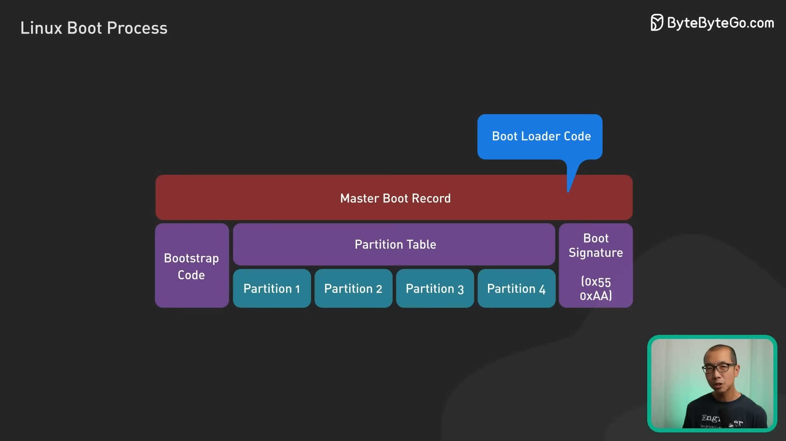

<h1>Linux Boots Process</h1>

 **Boot process** คือ กระบวนการทำงานของเครื่องตั้งแต่กดปุ่มเปิดเครื่องไปจนถึงแสดงหน้า login โดยทั่วไปจะมีอยู่ 6 stage ด้วยกัน

<br>

<p align="center">
  
</p>

<font size=1 ><p align="center">ภาพจาก : [https://aorjoa.medium.com/กระบวนการเริ่มทำงานของ-linux-boot-process-39f94200c9da](https://miro.medium.com/v2/resize:fit:400/format:webp/1*KpYUbpA5eUORU0jZeZrWPg.png)</p></font>
<br>

# 1. BIOS (Basic Input/Output System)
BIOS จะเริ่มทำงานหลังจากกดปุ่มเปิดเครื่องทำงานเป็นหลักในระดับ Hardware จากนั้นจะเกิดขั้นตอนที่เรียกว่า **POST (Power-On Self-Test)** เพื่อเช็คการทำงานและความถูกต้องของตัว Hardware สำคัญๆ ถ้าไม่มีอะไรผิดปกติ BIOS ก็จะไปเลือกตัว boot device ซึ่งปกติจะดูที่ hard drives ก่อนแล้วค่อยดูที่ USB แล้วค่อยดูที่ CD จากนั้นจะเรียกหาตัว boot loader มาใส่ไว้ใน memory ให้ boot loader รับหน้าที่ต่อแทน

<p align="center">
  
</p>

<font size=1 ><p align="center">ภาพจาก : [https://operavps.com/docs/linux-booting-process/](https://operavps.com/docs/linux-booting-process/)</p></font>

<br>
# 2. MBR (Master Boot Record)
หน้าที่ของ **MBR** คือเป็นที่อยู่ของ boot loader code (อยู่ใน sector แรกของ drive) และเป็นที่อยู่ของข้อมูลที่เกี่ยวกับ **GRUB** (หรือ **LILO** ในระบบที่เก่าหน่อย) 

<p align="center">
  
</p>

<font size=1 ><p align="center">ภาพจาก : [https://www.youtube.com/watch?v=XpFsMB6FoOs&t=214s](https://www.youtube.com/watch?v=XpFsMB6FoOs&t=214s)</p></font>

ซึ่งหน้าที่หลักของ MBR คือการโหลด GRUB มา executes 
โดยตัว MBR เองมีขนาด 512 bytes ประกอบไปด้วย 3 ส่วนก็คือ 
1.	Primary boot loader information 446 byte
2.	Partition table information 64 byte (16x4)
3.	MBR validation check 2 byte

<p align="center">
  
</p>

<font size=1 ><p align="center">ภาพจาก : [https://foxyknight29.medium.com/linux-booting-process-bb8f9036c43d](https://foxyknight29.medium.com/linux-booting-process-bb8f9036c43d)</p></font>

<br>

# 3. GRUB (Grand Unified Bootloader)
ตัว GRUB เองมีหน้าที่ execute kernel image (หรือ OS image) โดยจะแสดงหน้าจอขึ้นมาให้เราเลือกว่าต้องการจะใช้ kernel image ตัวไหน และใช้ initrd  ไหน
GRUB และ LILO เป็นตัว boot loader เหมือนกัน แต่จะต่างกัน Grub รู้จักตัว Filesystem ทำให้สามารถเข้าถึงและโหลดตัว kernel จาก filesystem ได้

โดยในปัจจุปันจะใช้ตัวที่ชื่อว่า GRUB2

<p align="center">
  
</p>

<font size=1 ><p align="center">ภาพจาก : [https://linuxmint-user-guide.readthedocs.io/en/latest/grub.html](https://linuxmint-user-guide.readthedocs.io/en/latest/grub.html)</p></font>

<br>
# 4. Kernel
 ใน stage นี้ตัว OS เองจะสามารถเข้าถึงทรัพยากรณ์ในเครื่องได้แล้ว
 
  พอ kernel ถูก boot loader init ขึ้นมาก็จะทำการ mount ตัว initrd (Initial RAM Disk) ให้เป็น root ของ file system (ซึ่งก็คือ ‘/’) แบบชั่วคราว จากนั้นก็จะ execute โปรแกรมใน /sbin/init ทำให้เกิด process แรกที่ชื่อ init (หากลองพิมพ์คำสั่ง ps -ef | grep init ดูก็จะเห็นว่ามี PID เป็น 1) 
  
  พอ kernel บูทเสร็จก็จะเกิดการ mount ตัว root file system ตัวจริง ที่มี drivers สำคัญเข้ามาช่วยในการเข้าถึงทรัพยากรณ์บนเครื่อง

<br>
# 5. init
Stage นี้ ตัว init system จะอ่านการตั้งค่าใน /etc/inittab เพื่อมาดูว่าจะต้องใช้ run level ไหนในการกำหนด  system states ซึ่งก็ขึ้นอยู่กับว่าถูกตั้ง default ไว้ยังไง โดยในแต่ละ run level ก็จะมี services และ processes ที่ต่างกันไปขึ้นอยู่กับว่าอยากให้ระบบทำอะไร สามารถแบ่งได้เป็น 0-6 level

0. halt
1. Single user mode
2. Multiuser, without NFS
3. Full multiuser mode
4. unused
5. X11
6. reboot

<p align="center">
  
</p>

<font size=1 ><p align="center">ภาพจาก : [https://foxyknight29.medium.com/linux-booting-process-bb8f9036c43d](https://foxyknight29.medium.com/linux-booting-process-bb8f9036c43d)</p></font>

<br>
และเรายังสามารถเปลี่ยน run level ได้ในขณะที่ระบบทำงานอยู่ได้ด้วยคำสั่ง

เช่นหากอยากเปลี่ยนเป็น run level 3
```sh
sudo systemctl isolate multi-user.target 
```	

หากอยากเปลี่ยนเป็น run level 5
```sh
sudo systemctl isolate graphical.target
```	

<br>
# 6. run level 
ใน stage นี้จะเกิดการ execute โปรแกรมที่ต้องใช้ใน run level ที่ถูกเลือกจาก directory ของแต่ละ run level เอง
ทำให้เราเห็น service บางตัวเริ่มทำงาน ซึ่งแน่นอนว่า service ของการ login ก็ด้วย 
เพราะงั้น Stage นี้เลยเป็น stage สุดท้ายของ boot process ในการเตรียมการให้พร้อมสำหรับ user interaction 

โดยใน /etc/rc.d/rc[run level].d/ directories จะเห็นโปรแกรมขึ้นต้นด้วยตัวอักษร **S** ไม่ก็ **K**	เช่น	
```sh
/etc/rc.d/rc3.d/S50apache2	
/etc/rc.d/rc3.d/K20mysql
```	
โดยตัวอักษร S จะหมายถึง Process ที่จะถูก executed ให้ **เริ่ม** ตอน startup<br>
ส่วนตัวอักษร K จะหมายถึง Process ที่จะถูก executed ให้ **หยุด** ตอน shutdown
